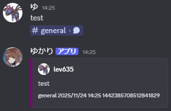
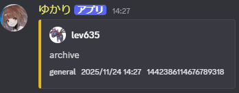
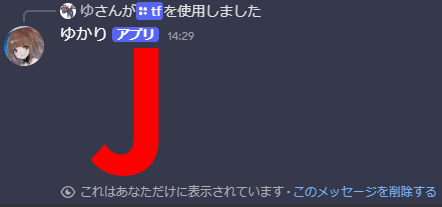

# discordbot
## 機能
- メッセージのリンクを貼ると内容を展開します。

  

- メッセージに一定以上のリアクションがついた場合、特定のチャンネルに再投稿します。

  

- 絵文字を画像化します。

  

## コマンド
| コマンド | 説明 |
| ---- | ---- |
| `/help` | ヘルプを表示します |
| `/tf {alies}` | 絵文字を画像化します |
| `/archive {url}` | 指定されたメッセージを再投稿します（リアクションがついた場合と同じ挙動） |

## 使い方
### 1. リポジトリのクローン
```
git clone git@github.com:lev635/discordbot.git
```
### 2. 環境変数の設定
- このアプリケーションは環境変数を用いて挙動を制御しています。
- 以下のように設定してください。

| 環境変数 | 説明 |
| ---- | ---- |
| `TOKEN` | discordbotのトークン |
| `ARCHIVE_CHANNEL` | メッセージ再投稿機能で投稿するチャンネルID |
| `ARCHIVE_CRITERION` | リアクションの閾値 |
| `ARCHIVE_EMOJI` | 集計対象となる絵文字のエイリアス |
| `TEMP_CHANNEL` | 画像を送信するチャンネルID（埋め込みで画像を表示する際に必要） |
| `COLOR_EMBED` | メッセージ展開機能のEmbedの色 |
| `COLOR_ARCHIVE` | メッセージ再投稿機能のEmbedの色 |

- 設定例が `.env.example` にあります。

### 3. デプロイ
- 所望のサービスにデプロイしてください。
